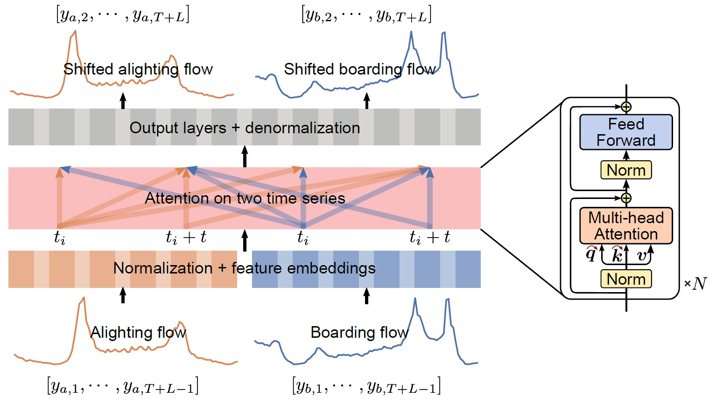
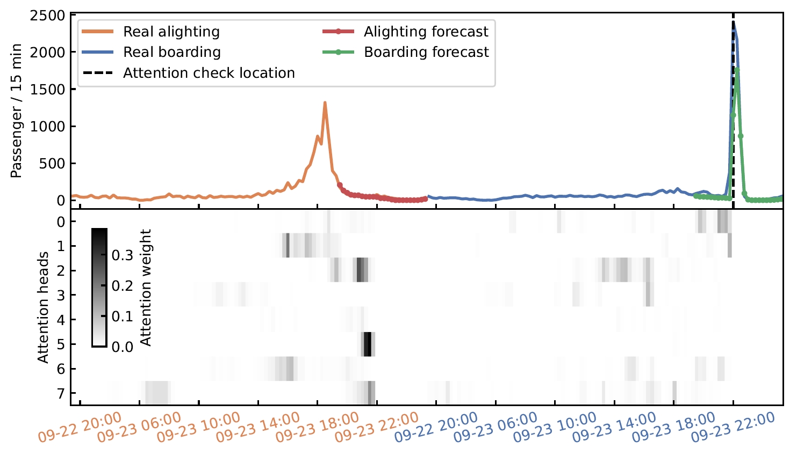

# Abnormal metro passenger demand is predictable
Code for "Abnormal metro passenger demand is predictable from alighting and boarding correlation"
The structure of the code is as follows:
```
├── models             <- Implementation of different models, including the proposed ABtransformer, Nlinear, and DeepAR.>
├── exps               <- Scripts to run experiments for different models. ->
     ├── ABtranformer  <- Experiments for the proposed ABtranformer. ->
     ├── Nlinear       <- Experiments for Nlinear. ->
     ├── DeepAR        <- Experiments for DeepAR. ->
├── datasets           <- Scripts to prepare datasets for training and testing for different models. ->
├── utilites           <- Utilities like loss functions, learning rate schedulers, etc. ->
├── data               <- Data for the experiments. -> 
```

The idea is to use attention to model long-range correlations between alighting and boarding flow in metro stations.
The model is named Alight-boarding Transformer (ABtransformer).
ABTrasnformer can predict abnormal passenger boarding demand with a long lead time.




The model is also interpretable, the boarding demand forecast at the checked location exhibits significant attention to periods
with abnormal alighting demand, indicating the parts of the input sequence that contribute to the forecast at the checked
location.
