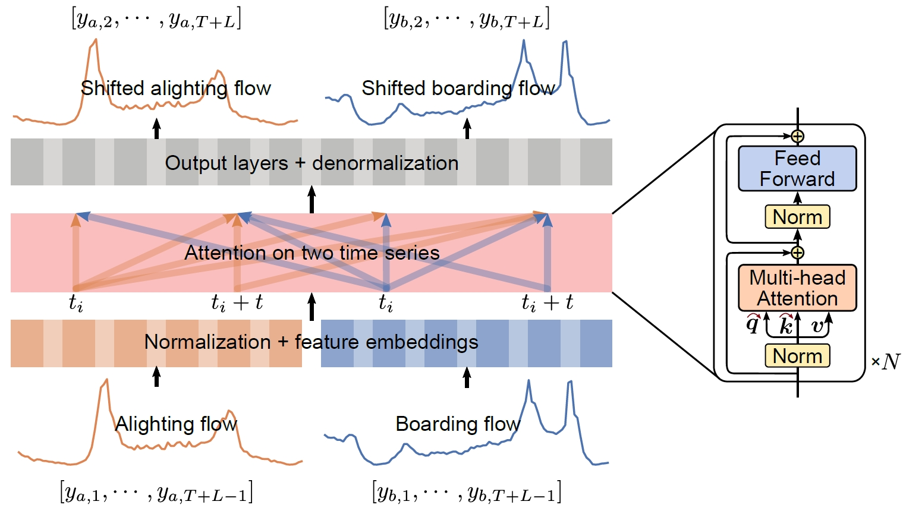
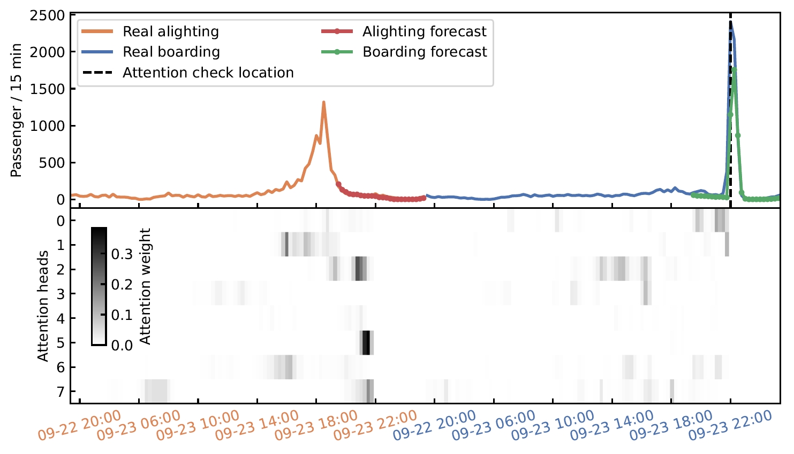

# Abnormal Metro Passenger Demand is Predictable

Code Repository for
_Abnormal Metro Passenger Demand is Predictable from Alighting and Boarding Correlation_, 
Zhanhong Cheng, Jiawei Wang, Martin Trépanier, and Lijun Sun.
Transportation Research Part C: Emerging Technologies, Vol. 128 (2025): 105239.

📄 https://doi.org/10.1016/j.trc.2025.105239


## Overview

This repository provides the implementation of the Alight-Boarding Transformer (ABTransformer) model proposed in the paper.
The core idea is to leverage attention mechanisms to model long-range dependencies between alighting and boarding passenger flows at metro stations. This approach is motivated by the empirical observation that surges in boarding demand are often preceded by unusual spikes in alighting demand at the same station.
- Alighting and boarding flows are encoded using two separate encoders.
- A cross-channel attention layer models the dependencies between these two flows.
- The model can predict abnormal boarding demand well in advance.



## Interpretability

The ABTransformer architecture is designed for both accurate forecasting and interpretability. The attention mechanism highlights periods of abnormal alighting demand that contribute significantly to future boarding forecasts at specific stations.



## Repository Structure
```
├── models/             # Implementations of all models, including ABTransformer, NLinear, and DeepAR
├── exps/               # Scripts to run experiments
│   ├── ABTransformer/  # Experiments for the proposed ABTransformer
│   ├── NLinear/        # Experiments for NLinear baseline
│   └── DeepAR/         # Experiments for DeepAR baseline
├── datasets/           # Data loading and preprocessing scripts
├── utilities/          # Utility functions (loss functions, schedulers, etc.)
├── data/               # Processed input datasets
```
